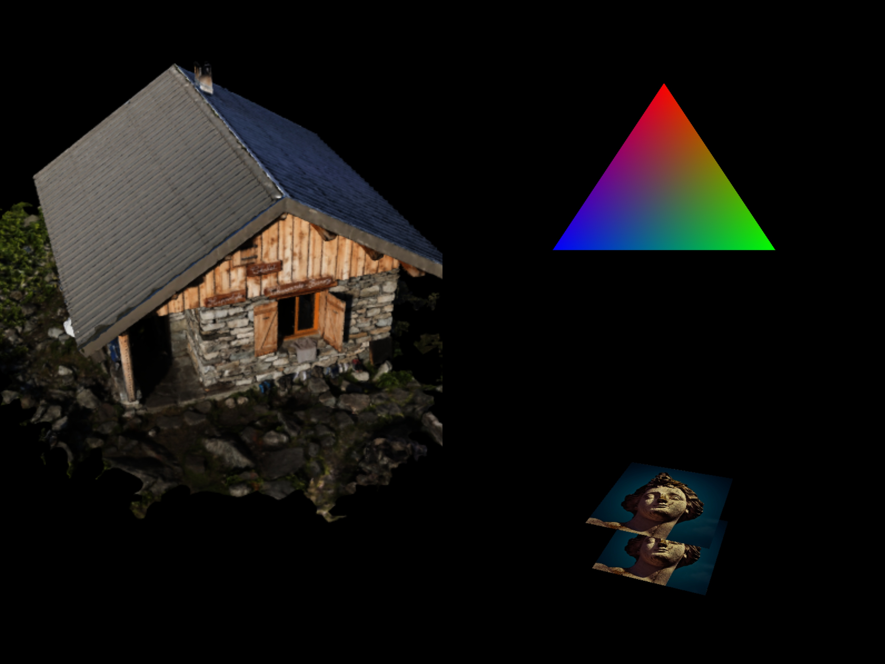

# JavaのVulkanチュートリアル (日本語版)
[Alexander Overvoordeによる素晴らしいチュートリアル](https://vulkan-tutorial.com/)をJavaに移植したものです。オリジナルのコードは[こちら](https://github.com/Overv/VulkanTutorial)。

 

---
* [はじめに](#はじめに)
* [LWJGL](#lwjgl)
   * [ネイティブハンドラ](#ネイティブハンドラ)
   * [ポインタと参照](#ポインタと参照)
   * [スタックの割り当て](#スタックの割り当て)
* [三角形の描画](#三角形の描画)
   * [準備](#準備)
      * [基本のコード](#基本のコード)
      * [インスタンス](#インスタンス)
      * [検証レイヤー](#検証レイヤー)
      * [物理デバイスとキューファミリー](#物理デバイスとキューファミリー)
      * [論理デバイスとキュー](#論理デバイスとキュー)
   * [プレゼンテーション](#プレゼンテーション)
      * [ウィンドウサーフェス](#ウィンドウサーフェス)
      * [スワップチェーン](#スワップチェーン)
      * [画像ビュー](#画像ビュー)
   * [グラフィックパイプラインの基本](#グラフィックパイプラインの基本)
      * [はじめに](#はじめに-1)
      * [シェーダーモジュール](#シェーダーモジュール)
      * [固定機能](#固定機能)
      * [レンダーパス](#レンダーパス)
      * [まとめ](#まとめ)
   * [描画](#描画)
      * [フレームバッファ](#フレームバッファ)
      * [命令バッファ](#命令バッファ)
      * [レンダリングとプレゼンテーション](#レンダリングとプレゼンテーション)
   * [スワップチェーンの再作成](#スワップチェーンの再作成)
* [頂点バッファ](#頂点バッファ)
    * [頂点入力の解説](#頂点入力の解説)
    * [頂点バッファの作成](#頂点バッファの作成)
    * [ステージングバッファ](#ステージングバッファ)
       * [独立した転送キューのバージョン](#独立した転送キューのバージョン)
    * [インデックスバッファ](#インデックスバッファ)
* [ユニフォームバッファ](#ユニフォームバッファ)
    * [記述子のレイアウトとバッファ](#記述子のレイアウトとバッファ)
    * [記述子のプールとセット](#記述子のプールとセット)
* [テクスチャマッピング](#テクスチャマッピング)
    * [画像](#画像)
    * [画像ビューとサンプラー](#画像ビューとサンプラー)
    * [結合した画像のサンプラー](#結合した画像のサンプラー)
* [深度バッファリング](#深度バッファリング)
* [モデルの読み込み](#モデルの読み込み)
* [ミップマップの生成](#ミップマップの生成)
* [マルチサンプリング](#マルチサンプリング)

## はじめに

これらのチュートリアルは、C++のチュートリアルに沿って簡単に進められるように書かれています。

なお、JavaとLWJGLのスタイルに合わせるために、いくつかの変更が行われています。当リポジトリは[オリジナル](https://github.com/Overv/VulkanTutorial/tree/master/code)と同じ構造になっています。

各チャプターには、それぞれ別々のJavaのコードが用意されています。しかし、多くのチャプターで共通するクラスがいくつかあります。

  - [AlignmentUtils](src/main/java/javavulkantutorial/AlignmentUtils.java): 均一なバッファオブジェクトのアライメントを扱うためのユーティリティクラス。
  - [Frame](src/main/java/javavulkantutorial/Frame.java): 実行中のフレームに必要なVulkanハンドル (*画像が利用可能なセマフォ*、*レンダー完了セマフォ*、*フェンス*)。
  - [ModelLoader](src/main/java/javavulkantutorial/ModelLoader.java): 3Dモデルを読み込むためのユーティリティクラス。[Assimp](http://www.assimp.org/)を利用しています。
  - [ShaderSPIRVUtils](src/main/java/javavulkantutorial/ShaderSPIRVUtils.java): GLSLシェーダをランタイムでSPIRVのバイナリにコンパイルするためのユーティリティクラス。

数値計算には、グラフィック数学用のJavaのライブラリである[JOML](https://joml-ci.github.io/JOML/)を使用します。これは[GLM](https://glm.g-truc.net/0.9.9/index.html)にかなりよく似ています。

最後に、各章にはそれぞれ.diffファイルが用意されており、章ごとの変更点をすぐ確認できます。

なお、本チュートリアルのJavaのコードはC/C++よりも冗長であり、その分ソースファイルが大きくなることをご了承ください。

## LWJGL

今回は、LWJGLという極めて低レベルなGLFW、Vulkan、OpenGL、その他CライブラリのJavaバインディングを使用します。

もしあなたがLWJGLを知らないのであれば、このチュートリアルに登場する概念やパターンを理解するのが難しいかもしれません。

ここでは、コードを正しく理解するために必要な、最も重要な概念を簡単に説明します。

### ネイティブハンドラ

Vulkanには、`VkImage`、`VkBuffer`、`VkCommandPool`など、適切に名付けられた独自のハンドルがあります。

これらは裏では符号なしの整数値であり、Javaにはその型定義がありません。

そのため、これらのオブジェクトの全ての型として`long`型を使用する必要があります。

これが、`long`型の変数がたくさん登場する理由です。

### ポインタと参照

構造体や関数の中には、他の変数への参照やポインタをパラメータとして受け取るものがあります。例えば、複数の値を出力するものが該当します。

この関数をC言語で考えてみましょう。

```C

int width;
int height;

glfwGetWindowSize(window, &width, &height);

// widthとheightは、ウィンドウの縦横の大きさです。

```

2つの`int`型のポインタを渡すと、関数はそのポインタが指すメモリを書き込みます。簡単で、しかも高速ですね。

では、Javaではどうなるでしょうか。そもそもポインタという概念がありませんよね。参照のコピーを渡して、関数の中でオブジェクトの内容を変更することはできますが、プリミティブ型ではそれができません。

方法は2つあります。まず、`int`型の配列を使用するか、Javaの[NIOバッファ](https://docs.oracle.com/javase/7/docs/api/java/nio/Buffer.html)を使用するかです。

LWJGLのバッファは、基本的にはウィンドウの配列で、内部に位置と制限があります。

後述しますが、これらのバッファを使用する際、ヒープから割り当てることができます。

上記の`glfwGetWindowSize`関数をNIOバッファで扱う場合は、以下のようになります。

```Java

IntBuffer width = BufferUtils.createIntBuffer(1);
IntBuffer height = BufferUtils.createIntBuffer(1);

glfwGetWindowSize(window, width, height);

// Print the values 
System.out.println("width = " + width.get(0));
System.out.println("height = " + height.get(0));

```

やりました！プリミティブな値のポインタを渡すことができましたね。…でも、たった2つの整数のために、2つも新しいオブジェクトを動的に割り当ててしまっています。

もしこの2つのオブジェクトが、短時間しか必要ないものだったらどうしましょう？ガベージコレクタが、これらの使い捨ての変数を掃除してくれるのを待たないといけませんね。

幸いなことに、LWJGLは独自のメモリ管理システムでこの問題を解決しています。詳しくは[こちら](https://github.com/LWJGL/lwjgl3-wiki/wiki/1.3.-Memory-FAQ)で知ることができます。

### スタックの割り当て

C/C++では、スタック上に簡単にオブジェクトを割り当てることができます。

```C++

VkApplicationInfo appInfo = {};
// ...

```

しかし、Javaではこれができません。

が、これまた幸運なことに、LWJGLではスタック上に変数を割り当てることができるようになっています。そのためには、[MemoryStack](https://javadoc.lwjgl.org/org/lwjgl/system/MemoryStack.html)のインスタンスが必要です。

スタックフレームは、関数の最初にプッシュ(スタックの末尾に追加)され、最後にポップ(取り出し)します。そのため、途中で何が起こっても構いません。try-with-resources構文を使い、この動作を真似てみましょう。

```Java

try(MemoryStack stack = stackPush()) {

  // ...
  
  
} // この行では、スタックがポップされ、このスタックフレーム内の全ての変数が解放されます。

```

いいですね！Javaでスタックの割り当てができるようになりました。どんなものか見てみましょう。

```Java

try(MemoryStack stack = stackPush()) {

  IntBuffer width = stack.mallocInt(1); // int型を1つ割り当て(未初期化)
  IntBuffer height = stack.ints(0); // 0で初期化

  glfwGetWindowSize(window, width, height);

  // 値を出力
  System.out.println("width = " + width.get(0));
  System.out.println("height = " + height.get(0));
}

```
さあ、`MemoryStack`を使った実際のVulkanの例を見てみましょう。
```Java

private void createInstance() {

    try(MemoryStack stack = stackPush()) {

        // 構造体を0で初期化するにはcallocを使います。そうしないと、ランダムな値が原因でプログラムがクラッシュすることがあります。

        VkApplicationInfo appInfo = VkApplicationInfo.callocStack(stack);

        appInfo.sType(VK_STRUCTURE_TYPE_APPLICATION_INFO);
        appInfo.pApplicationName(stack.UTF8Safe("Hello Triangle"));
        appInfo.applicationVersion(VK_MAKE_VERSION(1, 0, 0));
        appInfo.pEngineName(stack.UTF8Safe("No Engine"));
        appInfo.engineVersion(VK_MAKE_VERSION(1, 0, 0));
        appInfo.apiVersion(VK_API_VERSION_1_0);

        VkInstanceCreateInfo createInfo = VkInstanceCreateInfo.callocStack(stack);

        createInfo.sType(VK_STRUCTURE_TYPE_INSTANCE_CREATE_INFO);
        createInfo.pApplicationInfo(appInfo);
        // enabledExtensionCountは、ppEnabledExtensionNamesを呼び出した際に暗黙的に設定されます。
        createInfo.ppEnabledExtensionNames(glfwGetRequiredInstanceExtensions());
        // enabledLayerCountでも同様です。
        createInfo.ppEnabledLayerNames(null);

        // 作成したインスタンスのポインタを取得する必要があります。
        PointerBuffer instancePtr = stack.mallocPointer(1);

        if(vkCreateInstance(createInfo, null, instancePtr) != VK_SUCCESS) {
            throw new RuntimeException("Failed to create instance");
        }

        instance = new VkInstance(instancePtr.get(0), createInfo);
    }
}

```

## 三角形の描画
### 準備
#### 基本のコード

[Java版チュートリアル (日本語)](tutorials/drawing-a-triangle/setup/base-code.md)

[C++版チュートリアル (英語)](https://vulkan-tutorial.com/Drawing_a_triangle/Setup/Base_code)

[元のコード](https://github.com/Overv/VulkanTutorial/blob/master/code/00_base_code.cpp)

[Javaのコード](src/main/java/javavulkantutorial/Ch00BaseCode.java)

#### インスタンス

[チュートリアル](https://vulkan-tutorial.com/Drawing_a_triangle/Setup/Instance)

[元のコード](https://github.com/Overv/VulkanTutorial/blob/master/code/01_instance_creation.cpp)

[Javaの](src/main/java/javavulkantutorial/Ch01InstanceCreation.java)

[差分](src/main/java/javavulkantutorial/Ch01InstanceCreation.diff)

#### 検証レイヤー

[チュートリアル](https://vulkan-tutorial.com/Drawing_a_triangle/Setup/Validation_layers)

[元のコード](https://github.com/Overv/VulkanTutorial/blob/master/code/02_validation_layers.cpp)

[Javaのコード](src/main/java/javavulkantutorial/Ch02ValidationLayers.java)

[差分](src/main/java/javavulkantutorial/Ch02ValidationLayers.diff)


#### 物理デバイスとキューファミリー

[チュートリアル](https://vulkan-tutorial.com/Drawing_a_triangle/Setup/Physical_devices_and_queue_families)

[元のコード](https://github.com/Overv/VulkanTutorial/blob/master/code/03_physical_device_selection.cpp)

[Javaのコード](src/main/java/javavulkantutorial/Ch03PhysicalDeviceSelection.java)

[差分](src/main/java/javavulkantutorial/Ch03PhysicalDeviceSelection.diff)


#### 論理デバイスとキュー

[チュートリアル](https://vulkan-tutorial.com/Drawing_a_triangle/Setup/Logical_device_and_queues)

[元のコード](https://github.com/Overv/VulkanTutorial/blob/master/code/04_logical_device.cpp)

[Javaのコード](src/main/java/javavulkantutorial/Ch04LogicalDevice.java)

[差分](src/main/java/javavulkantutorial/Ch04LogicalDevice.diff)

### プレゼンテーション

#### ウィンドウサーフェス

[チュートリアル](https://vulkan-tutorial.com/Drawing_a_triangle/Presentation/Window_surface)

[元のコード](https://github.com/Overv/VulkanTutorial/blob/master/code/05_window_surface.cpp)

[Javaのコード](src/main/java/javavulkantutorial/Ch05WindowSurface.java)

[差分](src/main/java/javavulkantutorial/Ch05WindowSurface.diff)

#### スワップチェーン

[チュートリアル](https://vulkan-tutorial.com/Drawing_a_triangle/Presentation/Swap_chain)

[元のコード](https://github.com/Overv/VulkanTutorial/blob/master/code/06_swap_chain_creation.cpp)

[Javaのコード](src/main/java/javavulkantutorial/Ch06SwapChainCreation.java)

[差分](src/main/java/javavulkantutorial/Ch06SwapChainCreation.diff)

#### 画像ビュー

[チュートリアル](https://vulkan-tutorial.com/Drawing_a_triangle/Presentation/Image_views)

[元のコード](https://github.com/Overv/VulkanTutorial/blob/master/code/07_image_views.cpp)

[Javaのコード](src/main/java/javavulkantutorial/Ch07ImageViews.java)

[差分](src/main/java/javavulkantutorial/Ch07ImageViews.diff)

### グラフィックパイプラインの基礎
#### はじめに

[チュートリアル](https://vulkan-tutorial.com/Drawing_a_triangle/Graphics_pipeline_basics)

[元のコード](https://github.com/Overv/VulkanTutorial/blob/master/code/08_graphics_pipeline.cpp)

[Javaのコード](src/main/java/javavulkantutorial/Ch08GraphicsPipeline.java)

[差分](src/main/java/javavulkantutorial/Ch08GraphicsPipeline.diff)

#### シェーダーモジュール

シェーダーは[*shaderc*](https://github.com/google/shaderc)ライブラリを用いてSPIRVにコンパイルされます。GLSLファイルは[resources/shaders](src/main/resources/shaders/)フォルダにあります。

[チュートリアル](https://vulkan-tutorial.com/Drawing_a_triangle/Graphics_pipeline_basics/Shader_modules)

[元のコード](https://github.com/Overv/VulkanTutorial/blob/master/code/09_shader_modules.cpp)

[Javaのコード](src/main/java/javavulkantutorial/Ch09ShaderModules.java)

[差分](src/main/java/javavulkantutorial/Ch09ShaderModules.diff)

#### 固定機能

[チュートリアル](https://vulkan-tutorial.com/Drawing_a_triangle/Graphics_pipeline_basics/Fixed_functions)

[元のコード](https://github.com/Overv/VulkanTutorial/blob/master/code/10_fixed_functions.cpp)

[Javaのコード](src/main/java/javavulkantutorial/Ch10FixedFunctions.java)

[差分](src/main/java/javavulkantutorial/Ch10FixedFunctions.diff)

#### レンダーパス

[チュートリアル](https://vulkan-tutorial.com/Drawing_a_triangle/Graphics_pipeline_basics/Render_passes)

[元のコード](https://github.com/Overv/VulkanTutorial/blob/master/code/11_render_passes.cpp)

[Javaのコード](src/main/java/javavulkantutorial/Ch11RenderPasses.java)

[差分](src/main/java/javavulkantutorial/Ch11RenderPasses.diff)

#### まとめ

[チュートリアル](https://vulkan-tutorial.com/Drawing_a_triangle/Graphics_pipeline_basics/Conclusion)

[元のコード](https://github.com/Overv/VulkanTutorial/blob/master/code/12_graphics_pipeline_complete.cpp)

[Javaのコード](src/main/java/javavulkantutorial/Ch12GraphicsPipelineComplete.java)

[差分](src/main/java/javavulkantutorial/Ch12GraphicsPipelineComplete.diff)

### 描画
#### フレームバッファ

[チュートリアル](https://vulkan-tutorial.com/Drawing_a_triangle/Drawing/Framebuffers)

[元のコード](https://github.com/Overv/VulkanTutorial/blob/master/code/13_framebuffers.cpp)

[Javaのコード](src/main/java/javavulkantutorial/Ch13Framebuffers.java)

[差分](src/main/java/javavulkantutorial/Ch13Framebuffers.diff)

#### 命令バッファ

[チュートリアル](https://vulkan-tutorial.com/Drawing_a_triangle/Drawing/Command_buffers)

[元のコード](https://github.com/Overv/VulkanTutorial/blob/master/code/14_command_buffers.cpp)

[Javaのコード](src/main/java/javavulkantutorial/Ch14CommandBuffers.java)

[差分](src/main/java/javavulkantutorial/Ch14CommandBuffers.diff)

#### レンダリングとプレゼンテーション

[チュートリアル](https://vulkan-tutorial.com/Drawing_a_triangle/Drawing/Rendering_and_presentation)

[元のコード](https://github.com/Overv/VulkanTutorial/blob/master/code/15_hello_triangle.cpp)

[Javaのコード](src/main/java/javavulkantutorial/Ch15HelloTriangle.java)

[差分](src/main/java/javavulkantutorial/Ch15HelloTriangle.diff)

### スワップチェーンの再作成

[チュートリアル](https://vulkan-tutorial.com/Drawing_a_triangle/Swap_chain_recreation)

[元のコード](https://github.com/Overv/VulkanTutorial/blob/master/code/16_swap_chain_recreation.cpp)

[Javaのコード](src/main/java/javavulkantutorial/Ch16SwapChainRecreation.java)

[差分](src/main/java/javavulkantutorial/Ch16SwapChainRecreation.diff)

## 頂点バッファ
### 頂点入力の解説
*(検証レイヤーのエラーが発生しますが、次の章で修正します。)*

[チュートリアル](https://vulkan-tutorial.com/Vertex_buffers/Vertex_input_description)

[元のコード](https://github.com/Overv/VulkanTutorial/blob/master/code/17_vertex_input.cpp)

[Javaのコード](src/main/java/javavulkantutorial/Ch17VertexInput.java)

[差分](src/main/java/javavulkantutorial/Ch17VertexInput.diff)

### 頂点バッファの作成

[チュートリアル](https://vulkan-tutorial.com/Vertex_buffers/Vertex_buffer_creation)

[元のコード](https://github.com/Overv/VulkanTutorial/blob/master/code/18_vertex_buffer.cpp)

[Javaのコード](src/main/java/javavulkantutorial/Ch18VertexBuffer.java)

[差分](src/main/java/javavulkantutorial/Ch18VertexBuffer.diff)

### ステージングバッファ

[チュートリアル](https://vulkan-tutorial.com/Vertex_buffers/Staging_buffer)

[元のコード](https://github.com/Overv/VulkanTutorial/blob/master/code/19_staging_buffer.cpp)

[Javaのコード](src/main/java/javavulkantutorial/Ch19StagingBuffer.java)

[差分](src/main/java/javavulkantutorial/Ch19StagingBuffer.diff)

#### 独立した転送キューのバージョン

[Javaのコード](src/main/java/javavulkantutorial/Ch19StagingBufferTransferQueue.java)

[差分](src/main/java/javavulkantutorial/Ch19StagingBufferTransferQueue.diff)

### インデックスバッファ

[チュートリアル](https://vulkan-tutorial.com/Vertex_buffers/Index_buffer)

[元のコード](https://github.com/Overv/VulkanTutorial/blob/master/code/20_index_buffer.cpp)

[Javaのコード](src/main/java/javavulkantutorial/Ch20IndexBuffer.java)

[差分](src/main/java/javavulkantutorial/Ch20IndexBuffer.diff)

## ユニフォームバッファ
### ユニフォームバッファオブジェクト

#### 記述子のレイアウトとバッファ

[チュートリアル](https://vulkan-tutorial.com/Uniform_buffers/Descriptor_layout_and_buffer)

[元のコード](https://github.com/Overv/VulkanTutorial/blob/master/code/21_descriptor_layout.cpp)

[Javaのコード](src/main/java/javavulkantutorial/Ch21DescriptorLayout.java)

[差分](src/main/java/javavulkantutorial/Ch21DescriptorLayout.diff)

#### 記述子のプールとセット

[チュートリアル](https://vulkan-tutorial.com/Uniform_buffers/Descriptor_pool_and_sets)

[元のコード](https://github.com/Overv/VulkanTutorial/blob/master/code/22_descriptor_sets.cpp)

[Javaのコード](src/main/java/javavulkantutorial/Ch22DescriptorSets.java)

[差分](src/main/java/javavulkantutorial/Ch22DescriptorSets.diff)


## テクスチャマッピング
### 画像

[チュートリアル](https://vulkan-tutorial.com/Texture_mapping/Images)

[元のコード](https://github.com/Overv/VulkanTutorial/blob/master/code/23_texture_image.cpp)

[Javaのコード](src/main/java/javavulkantutorial/Ch23TextureImage.java)

[差分](src/main/java/javavulkantutorial/Ch23TextureImage.diff)

### 画像ビューとサンプラー

[チュートリアル](https://vulkan-tutorial.com/Texture_mapping/Image_view_and_sampler)

[元のコード](https://github.com/Overv/VulkanTutorial/blob/master/code/24_sampler.cpp)

[Javaのコード](src/main/java/javavulkantutorial/Ch24Sampler.java)

[差分](src/main/java/javavulkantutorial/Ch24Sampler.diff)

### 結合した画像のサンプラー

[チュートリアル](https://vulkan-tutorial.com/Texture_mapping/Combined_image_sampler)

[元のコード](https://github.com/Overv/VulkanTutorial/blob/master/code/25_texture_mapping.cpp)

[Javaのコード](src/main/java/javavulkantutorial/Ch25TextureMapping.java)

[差分](src/main/java/javavulkantutorial/Ch25TextureMapping.diff)


## 深度バッファリング

[チュートリアル](https://vulkan-tutorial.com/Depth_buffering)

[元のコード](https://github.com/Overv/VulkanTutorial/blob/master/code/26_depth_buffering.cpp)

[Javaのコード](src/main/java/javavulkantutorial/Ch26DepthBuffering.java)

[差分](src/main/java/javavulkantutorial/Ch26DepthBuffering.diff)

## モデルの読み込み

モデルの読み込みには[Assimp](https://assimp.org/)を使用します。これは、異なるフォーマットの3Dモデルを読み込むライブラリであり、LWJGLのバインディングの一部として含まれています。

今回は、Assimpを用いたモデルの読み込みに関する処理を[ModelLoader](src/main/java/javavulkantutorial/ModelLoader.java)クラスにまとめています。

[チュートリアル](https://vulkan-tutorial.com/Loading_models)

[元のコード](https://github.com/Overv/VulkanTutorial/blob/master/code/27_model_loading.cpp)

[Javaのコード](src/main/java/javavulkantutorial/Ch27ModelLoading.java)

[差分](src/main/java/javavulkantutorial/Ch27ModelLoading.diff)

## ミップマップの生成

[チュートリアル](https://vulkan-tutorial.com/Generating_Mipmaps)

[元のコード](https://github.com/Overv/VulkanTutorial/blob/master/code/28_mipmapping.cpp)

[Javaのコード](src/main/java/javavulkantutorial/Ch28Mipmapping.java)

[差分](src/main/java/javavulkantutorial/Ch28Mipmapping.diff)

## マルチサンプリング

[チュートリアル](https://vulkan-tutorial.com/Multisampling)

[元のコード](https://github.com/Overv/VulkanTutorial/blob/master/code/29_multisampling.cpp)

[Javaのコード](src/main/java/javavulkantutorial/Ch29Multisampling.java)

[差分](src/main/java/javavulkantutorial/Ch29Multisampling.diff)


---
*アイコンは[Icon Mafia](https://iconscout.com/contributors/icon-mafia)が制作しました。*

## 日本語版の免責事項

当ドキュメントは、[Genbuchan](https://github.com/Genbuchan)がJavaでVulkanを学習するために、独自で日本語化したものです。

そのため、原文と日本語版の文脈に齟齬がある可能性があります。

もし、ドキュメントの問題の指摘や改善に協力してくださる方がいらっしゃいましたら、IssueまたはPull Requestをお願いします。

翻訳の補助には[DeepL Translator](https://www.deepl.com)を使用しました。
